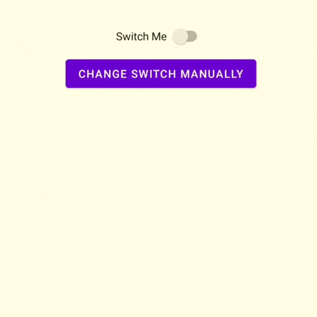

# AdvanceSwitch

An Android Switch widget based on AndroidX SwitchCompact with advance click and change handling.

## Sample

## Implementation
**Step 1:** Add to project level build.gradle

    allprojects {
		repositories {
			...
			maven { url 'https://jitpack.io' }
		}
	}

**Step 2:** Add to app level build.gradle

	dependencies {
	    implementation 'com.github.u-barnwal:AdvanceSwitch:VERSION'
	}
## How to use
**Step 1:** Create view

    <com.isolpro.library.advanceswitch.AdvanceSwitch
      android:id="@+id/switchMain"
      android:layout_width="wrap_content"
      android:layout_height="wrap_content" />
    
**Step 2:** Add change listener

	@Override
	protected void onCreate(Bundle savedInstanceState) {
	    ...

	    AdvanceSwitch switchMain = findViewById(R.id.switchMain);
	    
	    switchMain.setOnCheckedChangeListener((buttonView, isChecked) -> {
          Toast.makeText(this, "Listened to change!", Toast.LENGTH_SHORT).show();
        });
	}

**Changing checked without triggering listener**

    switchMain.setCheckedManually(true); // check 
    switchMain.setCheckedManually(false); // uncheck 
    switchMain.toggleManually(); // toggle 

**Changing checked while triggering listener**

    switchMain.setChecked(true); // check 
    switchMain.setChecked(false); // uncheck 
    switchMain.toggle(); // toggle 

## Features

 - Used just like default Switch widget
 - Doesn't reserve the view tag (setTag() or getTag() are not being used).
 - Easy to use
 - Light weight

## Links
 - Live example: https://transactionslistlite.isolpro.in
